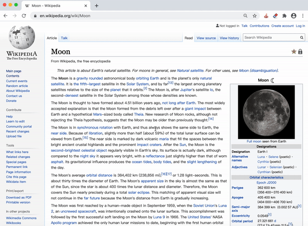

# Eraser

## Quick Access
The chrome extention can be easily download [here](https://github.com/SamanthaCui/abc-student-repo/raw/master/projects/bug-project/bug-project.zip).

## Description
Remember the days when you go on Wikipedia and copy/paste some definitions straight to your homework? Well, you're in "luck"! Try and do that with this Chrome extension. :P
