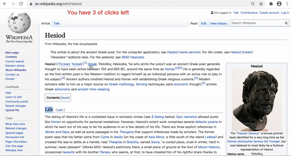

# "Highlighter"

## Quick Access
The chrome extention can be easily download [here](https://github.com/SamanthaCui/abc-student-repo/raw/master/projects/bug-project/bug-project.zip).
 
(This chrome extention is specifically designed for a Wikipedia page.)

## Description
If you download this Chrome extension, well then congradualations!
 
You've been given the gift of TIME and efficiency!
 
You are only allowed 30 clicks in one browser. You could use it for links, or just to click to release stress. Onced you've used up all of them, you can't gain access to any links anymore. You could now use the time you've saved for other activities :D
 
So use them wisely, enjoy some efficient web exerpience.    
 
