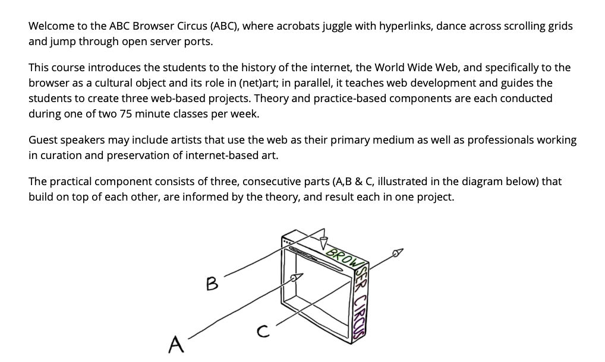
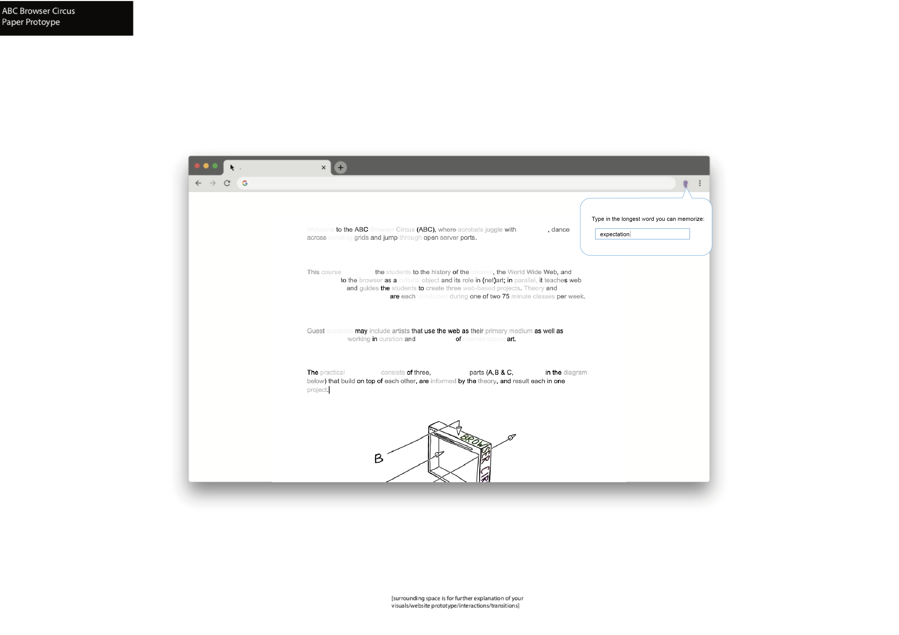

# Project B Proposal

## Before

## After

## Description
Have you ever felt intimidated by the long words appearing in your browser window? Have you ever wished that all the articles were just composed by words with less than five letters? Inspired by the stressful process of memorizing vocabulary, we’ve created this extension to “help” with people’s fear towards complicated vocabulary. This extension allows you to choose the length of the words you can tolerate in a webpage. For example, when you open up Wikipedia and search for a definition, hundreds of words (including professional terminology) pops up and it is stressful to read through all of them. Well, fear no more! With our extension, you could type in the word with the number letters you could tolerate. Once you submit it to the extension, then the page will reorganize as only words with letters less than what you’ve input would appear in the text. It will also calculate the difference between the maximum letters in a word and the minimum and then map the difference with RGB value. In this way, words will also appear with a fade of color, where the words with the least letters will appear black, and the ones with the most would appear light-grey.
 
 
Our design aims to bring a little more humor and surprise to an ordinary webpage. Of course it’s unnecessary to use this extension when we are actually reading through the page. But for users where English isn’t their first language, we hope this extension will spice up the tiring view to see long words when they receive an email or read through the news. We design this extension to be a tool for any website the user may browse. For every page you enter, you could simply click on this extension, and enjoy a much more simple and stress-free website.
