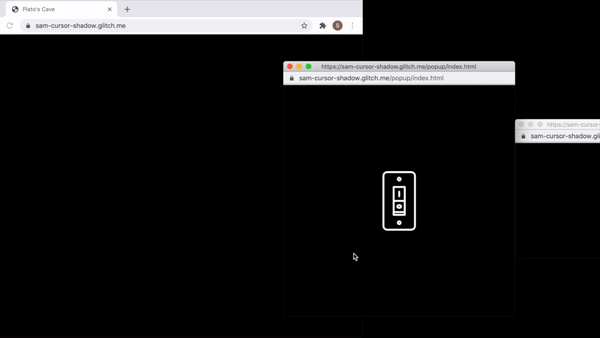
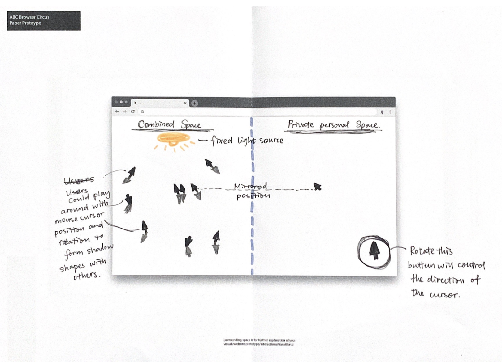
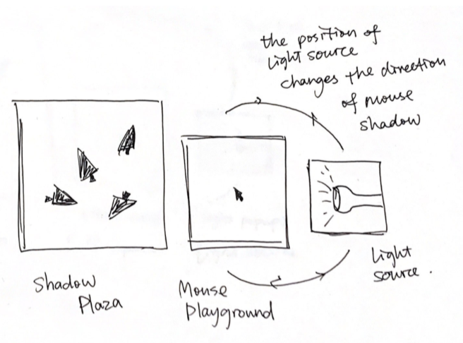
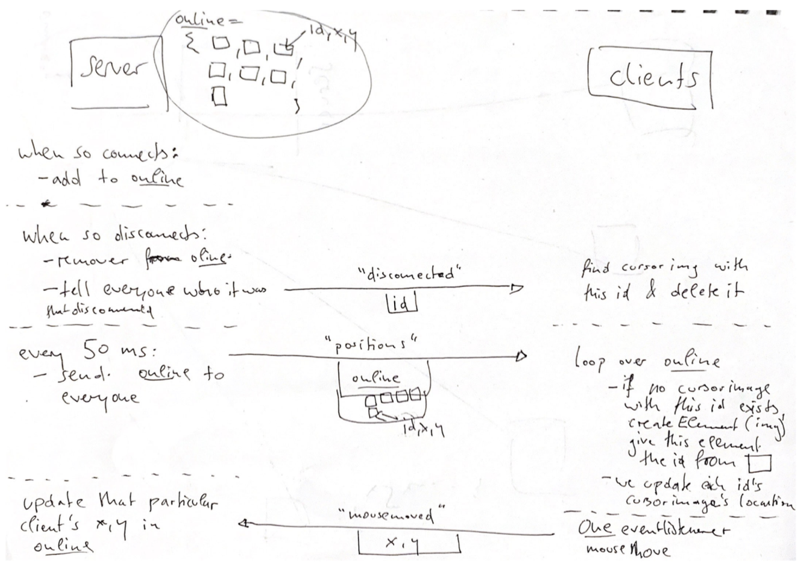
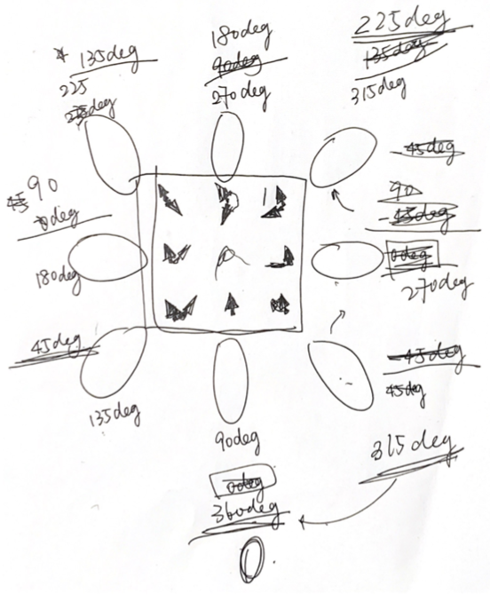

# Plato's Popup

## Inspirations
[Allegory of the cave](https://en.wikipedia.org/wiki/Allegory_of_the_cave).

## Original Paper Prototype

## Final Paper Prototype

## Quick Access
The website can be easily accessed [here](https://sam-cursor-shadow.glitch.me/).

## Description
Inspired by Plato's Cave, this project seeks to explore different layers of the cave in a two-dimensional webpage setting. As you open the page, it will open into three windows. As you turn on the light switch, you would see that the middle window is a playground for your mouse to move. On the contrary, the main window won't show your mouse but only the shadow of your mouse. You could also drag the third window where there's a light source to change the shape and sizes of your shadow. As other users join in, you could see their shadows on the shadow plaza. Now you could work with other users and form various shadow shapes.   

## Technical Challenges
For this project, the main technical challenge was figuring out the right logic and order to how the data should be sent between the main window and the popup window, and between the server and each user. Professor helped me to draw a logic map to better understand. This was one of the main problems that confused me during the project de3velopment.  

Another issue I ran into besides the logic was how I could make the image appear on every client's page. At first,  each client could receive all the data from other clients, but the image of the cursor could only be drawn once. After trying several methods of using arrays and for loops, I've realized I've been drawing in the wrong function where I got lost between the data transporting. After re-organizing the code, I found the right place where the image would be drawn every time.

The last challenge I had to face was figuring out the right mathematical relationship between how the light source rotation would affect the shadow. Even though in the end it didn't seem to work that well, while designing this function, I went over each keypoint individually on how the rotation would be. I think I should've played with shadows more to find the correct relationship. But I find the method of drawing the points one by one to be very helpful to clear the mess in my head.

## Compromises
The main compromise I had to make was trying to fit the shadow idea into a flat-screen. From the inspirations I've seen, it's clear that all of them had a z-axis relationship within them. So it's the question of how could I find that relationship within webpage windows. I ended up using popup because I thought the different window sizes and being able to be on top of each other would create that visual effect. But it turns out it's not that clear and it brings up the issue of which popup window is being focused on would end up being the top one. Even after class, the professor and I were brainstorming ideas on how the interface could be better designed. We brought up some interesting ideas that I would love to try out.

## Shortcomings
As I mentioned before, the interface needs to be improved. Whether popups are the best way to display this idea is uncertain. The improvements besides the interface are more towards perfecting some details to polish the user experience. For example the resizing of the main window, the correct mathematical relationship of the shadows and the angle, and considering different screen sizes.   
